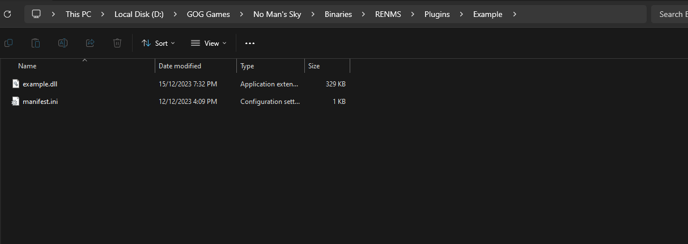

# Example ReNMS Plugin

You should just need to run `git clone https://github.com/VITALISED/renms_plugin_example.git --recurse-submodules` to get started.

Make sure to build in Release/RelWithDebInfo or else the structures will be the wrong size! Also avoid building ALL, you should really only build your target. We have targets defined that will cause ALL to fail.

## How do I use the DLL?

First off, go to your ReNMS install. Usually this is `.../No Man's Sky/Binaries/RENMS`. Create a new directory in the Plugins folder for your plugin.
This can be `my_awesome_plugin`. Next, edit the provided file `manifest.ini`, this provides some rough metadata for ReNMS to use.

It could look something like this

```ini
[manifest]
name=ReNMS Example Plugin
author=VITALISED
description =A plugin with a description you could change somewhere that describes many things about what this mod does. Could have a link or anything really.
;icon=icon.png
library_name=VITALISED.MyAwesomePlugin.dll ; make this unique

; These are currently unused, but we plan to maybe use these values.

[psarc]
;mypak=./psarc/whatever.pak

[plugin]
priority=0 ; Lower should equal higher priority
is_win_supported=true
is_osx_supported=false
```

The final product may look something like this in your file explorer.

